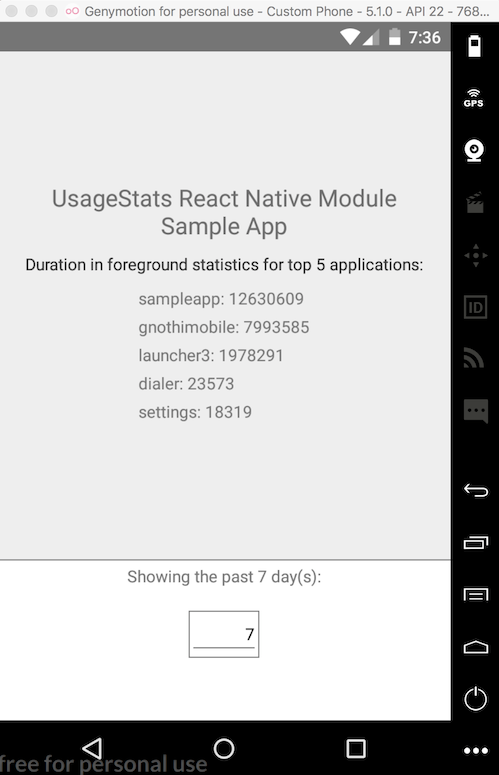

# UsageStatsModule [WIP]
A sample React Native application demonstrating the use of [Modules](https://facebook.github.io/react-native/docs/native-modules-android.html) to make the Android platform's [UsageStats](https://developer.android.com/reference/android/app/usage/UsageStats.html) class available from within your JavaScript code. Quickly obtain statistics on app usage over the past day, week or month.



Environment and sample application were setup using the React Native tutorial [here](https://facebook.github.io/react-native/docs/getting-started.html).

The Java resource I used as a guide is Cole Murray's [UsageStatsSample](https://github.com/ColeMurray/UsageStatsSample).

# Setup

## Add Module
We'll start by creating the module:
```java
// android/app/src/main/java/com/sampleapp/packages/UsageStatsModule.java

package com.sampleapp.packages;

...

public class UsageStatsModule extends ReactContextBaseJavaModule {

  public UsageStatsModule(ReactApplicationContext reactContext) {
    super(reactContext);
  }

  @Override
  public String getName() {
    return "UsageStats";
  }

  ...

  @ReactMethod
  public void getSomeStats() {
      ...
  }
}

```
You'll need to copy the full module from the same location in this repo.

## Create Package
In the `packages` folder you've just created we'll create a package comprised of this module (and any others you'd like to include)
```java
// android/app/src/main/java/com/sampleapp/packages/ModulesPackage.java

package com.sampleapp.packages;

import com.facebook.react.ReactPackage;
import com.facebook.react.bridge.JavaScriptModule;
import com.facebook.react.bridge.NativeModule;
import com.facebook.react.bridge.ReactApplicationContext;
import com.facebook.react.uimanager.ViewManager;

import java.util.ArrayList;
import java.util.Collections;
import java.util.List;

public class ModulesPackage implements ReactPackage {
  @Override
  public List<Class<? extends JavaScriptModule>> createJSModules() {
    return Collections.emptyList();
  }

  @Override
  public List<ViewManager> createViewManagers(ReactApplicationContext reactContext) {
    return Collections.emptyList();
  }

  @Override
  public List<NativeModule> createNativeModules(
                              ReactApplicationContext reactContext) {
    List<NativeModule> modules = new ArrayList<>();

    modules.add(new UsageStatsModule(reactContext));
    // Add any other modules you'd like here

    return modules;
  }
}
```

## MainApplication
We'll make the package available in `MainApplication.java`, like so:
```java
// android/app/src/main/java/com/sampleapp/MainApplication.java

package com.sampleapp;

import com.sampleapp.packages.*;

...

public class MainApplication extends Application implements ReactApplication {

  private final ReactNativeHost mReactNativeHost = new ReactNativeHost(this) {
    ...

    @Override
    protected List<ReactPackage> getPackages() {
      return Arrays.<ReactPackage>asList(
          new MainReactPackage(),
          new ModulesPackage()
      );
    }
  };

  ...
}
```
Again, note that only relevant code is shown for brevity's sake; the above will not make a complete `MainApplication` class

## MainActivity
When the main activity starts, we'll want to ensure the app has the appropriate permissions turned on. I'm sure there is a better way to do this, but I'm using [this](https://github.com/ColeMurray/UsageStatsSample) as a guide, so we'll just check whether one of our methods returns an empty `List`:
```java
// android/app/src/main/java/com/sampleapp/MainActivity.java

...

@Override
protected void onCreate(Bundle savedInstanceState) {
    super.onCreate(savedInstanceState);

    //Check if permission enabled
    if (UsageStatsModule.getUsageStatsList(this).isEmpty()){
        Intent intent = new Intent(Settings.ACTION_USAGE_ACCESS_SETTINGS);
        startActivity(intent);
    }
}

...

```
Next, the above won't be helpful unless we've add the necessities to our manifest...

## AndroidManifest.xml
```xml
<!---android/app/src/main/AndroidManifest.xml--->

<manifest xmlns:android="http://schemas.android.com/apk/res/android"
    xmlns:tools="http://schemas.android.com/tools"
    ...
    />

...

<uses-permission
    android:name="android.permission.PACKAGE_USAGE_STATS"
    tools:ignore="ProtectedPermissions" />

...

```
## Import Native Modules in JS
To make sure you've got the plumbing correct, let's import the module within a JavaScript file and test it out:
```JavaScript
// /index.android.js

import { NativeModules } from 'react-native';
const UsageStats = NativeModules.UsageStats;

...

export default class SampleApp extends Component {
  render() {

    UsageStats.testToast(UsageStats.SHORT);
    return (
      ...
    );
  }
}

```
Start up an emulator and run `react-native run-android` from a terminal. I use [Genymotion](https://www.genymotion.com/account/login/). If everything is working properly, you should see a toast with the message, 'It works!' when the app starts up.

# Viewing Logs
With an emulator running, run `adb logcat *:S ReactNative:V ReactNativeJS:V` in a separate terminal app to view console logs.

# Todo
- [X] Add module
- [X] Add basic module setup instructions
- [ ] Find a better way to pass data between Java module and JS
- [ ] Add methods to UsageStatsModule
    + [ ] getRangeStats()
    + [ ] getPastDayStats()
    + [ ] getPastWeekStats()
    + [ ] getPastMonthStats()
- [ ] Add example method calls
- [ ] Enable sample method calls from React Native app
- [ ] Add sample React Native application using module
